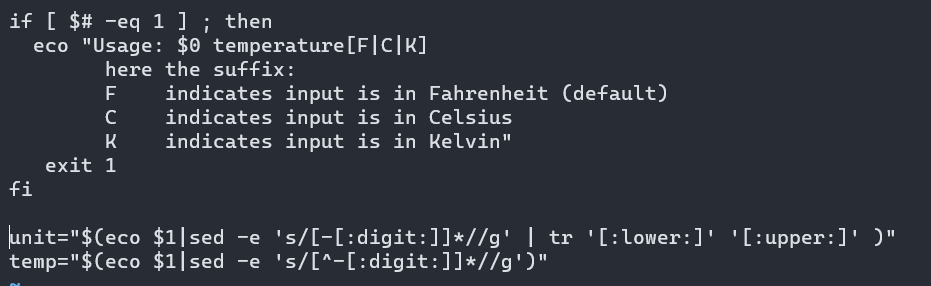
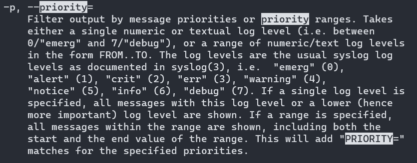
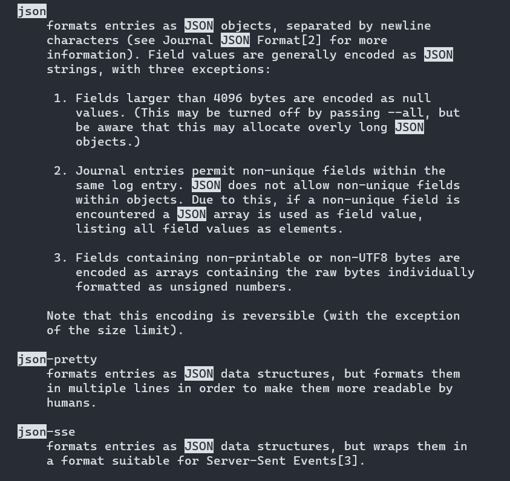
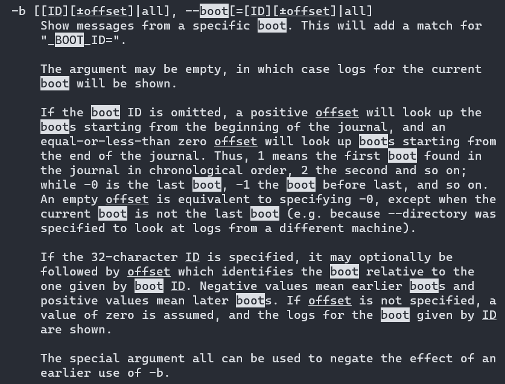

# Exam_2420

## Part 1 - Update Software

1. `sudo apt update`
2. `sudo apt upgrade`

## Part 2 - Replace
1. Replace V with C `:%s/V/C/g`
2. Replace numbs with :digit: `:%s/numbs/:digit:/g`


## Part 3 - journalctl

* I searched using /priority and shift+n to find the priority.


* I searched for json to find the `--output` option.


* I searched the man page using /boot


* Working Command


## Part 4 - Find Users

```bash
#!/bin/bash

function display(){
        echo Regular users on the system are:
        grep ':[1-5][0-9][0-9][0-9]:' /etc/passwd | awk -F ":" '{print $1,$3,$6}'

        echo ""
        echo "Users currently logged in are:"
        who | awk '{print $1}'
}

display

display > /etc/motd
```

## Part 5 - Service File


* Service file is located in `/etc/systemd/system`

```
[Unit]
Description=Tool to list users and output them to /etc/motd file

[Service]
Type=simple
ExecStart=/opt/find_users/find_users

[Install]
WantedBy=mutli-user.target
```